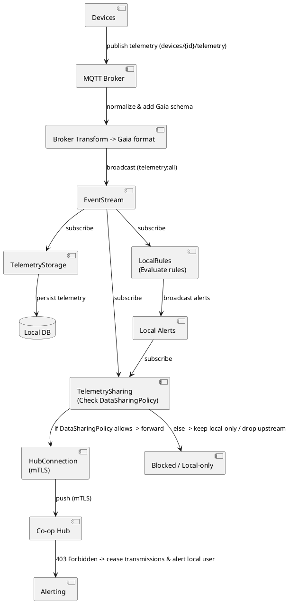

# ADR-006: Device Data Flow — Broker Normalization & Parallel Telemetry Processing

Date: 2026-01-08
Status: Proposed
Authors: Farm Node Architecture (documented by the engineering assistant)

## Context

Devices on the farm publish telemetry to an MQTT broker. The broker may perform protocol-level normalization (parsing device-specific payloads into a canonical "Gaia" schema). The Farm Node ingests normalized messages, persists them in a local database, and publishes internal events to the system (e.g., telemetry events via `EventStream`).

Per Project rules:

- Default `DataSharingPolicy` must be `share_nothing`.
- The Node must remain offline-first (local autonomy).
- mTLS certificates provisioned during node provisioning must be stored securely (e.g., `priv/ssl/`) and used by `HubConnection` for upstream push.
- On `403 Forbidden` from the Hub, the node must immediately stop pushing data upstream and alert local users.

This ADR records the decision to use parallel telemetry processors: `TelemetryStorage` for local persistence, `TelemetrySharing` as the explicit data sharing gate, and `LocalRules` for rule evaluation. All three modules subscribe directly to the telemetry source (broker) and run in parallel.

## Decision

- Broker-side transforms will normalize raw device payloads into Gaia format before publishing to farm node topics (this simplifies downstream processing).
- Three parallel modules subscribe to the telemetry source and process telemetry independently:
  - **`TelemetryStorage`**: Subscribes to telemetry events and persists them in the Local DB for future use. This ensures all telemetry is stored locally regardless of sharing decisions.
  - **`TelemetrySharing`**: Subscribes to telemetry events and local alerts. Acts as the main gateway for shared data by:
    - Checking the `DataSharingPolicy` for each telemetry/alert.
    - If policy allows sharing, forwards to `HubConnection`.
    - If policy denies sharing, keeps the data local-only.
  - **`LocalRules`**: Subscribes to telemetry events and evaluates rules to derive alerts/actions (e.g., "pest sighting", "soil dry"). Broadcasts local alerts via `EventStream`.
- `HubConnection` remains the only component trusted to communicate with the Co-op Hub. It must:
  - Load node identity (mTLS certs) from secure storage (e.g., `priv/ssl/`).
  - Maintain a heartbeat to the Hub and stop communications + alert on `403 Forbidden`.
  - Implement defense-in-depth by re-checking `DataSharingPolicy` before sending anything upstream (to handle future producers).
- All events forwarded upstream must be recorded in an audit log for compliance and traceability.

## Consequences

Positive:

- **Parallel processing**: TelemetryStorage, TelemetrySharing, and LocalRules run independently, improving system resilience and performance.
- **Clear separation of concerns**: 
  - TelemetryStorage handles persistence
  - TelemetrySharing acts as the explicit data sharing gate
  - LocalRules handles rule evaluation and alert generation
  - HubConnection handles upstream communication
- **Near-source enforcement of privacy**: Events that should not leave the Node are blocked at TelemetrySharing, the main gateway for shared data.
- **Easier auditing**: TelemetrySharing is the single place to record what was shared or blocked.
- **Better naming**: "TelemetrySharing" clearly indicates its role as the gateway for shared data, unlike "LocalRules" which didn't reflect this responsibility.

Costs / Tradeoffs:

- TelemetrySharing must be robust and highly available to avoid blocking legitimate sharing (use supervision and appropriate timeouts).
- Additional tests and monitoring are required to ensure policy logic is correct.
- We must document the types of telemetry/alerts and policy rules clearly so TelemetrySharing can make deterministic decisions.
- Multiple subscribers to the same telemetry source requires careful coordination to avoid race conditions.

## Alternatives considered

1. Enforce policy only in `HubConnection`:
   - Simpler implementation, but allows potentially sensitive events to traverse system internals and complicates auditing.
2. Enforce policy at broker (server-side):
   - Could be efficient but doesn't account for rule-derived alerts that only LocalRules can compute.
3. Make LocalRules the sharing gate:
   - Conflates two responsibilities (rule evaluation and data sharing decisions), making it harder to reason about and maintain.
4. Sequential processing (DeviceManagement → LocalRules → TelemetrySharing):
   - Creates unnecessary dependencies between components and reduces resilience.

We chose parallel processors with TelemetrySharing as the explicit sharing gate because it provides clear separation of concerns, better naming, and allows each component to focus on a single responsibility. This aligns with the project's privacy-by-design principle.

## Implementation notes

Responsibilities:

- **`TelemetryStorage`**:
  - Subscribe to telemetry events (e.g., `telemetry:all` via EventStream).
  - Persist all incoming telemetry to Local DB.
  - Track storage metrics (count, last stored).
  - Run independently of sharing decisions.

- **`TelemetrySharing`**:
  - Subscribe to telemetry events (e.g., `telemetry:all`).
  - Subscribe to local alerts (e.g., `local_alerts`).
  - Consult `DataSharingPolicy` module (policy provider) for each telemetry/alert.
  - Forward approved data to `HubConnection.push_*` functions.
  - Block/drop data that policy denies.
  - Track sharing metrics (shared count, blocked count).

- **`LocalRules`**:
  - Subscribe to telemetry events (e.g., `telemetry:all`).
  - Evaluate configured rules (use `with` pattern / guard clauses).
  - Broadcast local alerts via EventStream when rules match.
  - Do NOT check DataSharingPolicy (that's TelemetrySharing's job).

- **`HubConnection`**:
  - Uses mTLS certs (from `priv/ssl/` or encrypted store).
  - Exposes an API `push_alert/1`, `push_telemetry/1`, and `heartbeat/0`.
  - On `403` heartbeat response: emit `HubCertificateRevoked` event, stop all pushes, and alert local user.
  - Implements defense-in-depth by re-checking `DataSharingPolicy` before sending.

Example handlers (illustrative):

```elixir
defmodule TelemetryStorage do
  def handle_info({:telemetry, _topic, telemetry}, state) do
    # Store telemetry in Local DB
    persist_to_db(telemetry)
    {:noreply, update_state(state, telemetry)}
  end
end

defmodule TelemetrySharing do
  def handle_info({:telemetry, _topic, telemetry}, state) do
    # Check policy and forward if allowed
    if Policy.share_telemetry?(telemetry) do
      HubConnection.push_telemetry(telemetry)
    end
    {:noreply, state}
  end
  
  def handle_info({:event, "local_alerts", alert}, state) do
    # Check policy and forward if allowed
    if Policy.share_alert?(alert) do
      HubConnection.push_alert(alert)
    end
    {:noreply, state}
  end
end

defmodule LocalRules do
  def handle_info({:telemetry, _topic, telemetry}, state) do
    # Evaluate rules and broadcast alerts
    case evaluate_rules(telemetry) do
      nil -> :ok
      %Alert{} = alert ->
        EventStream.broadcast("local_alerts", alert)
    end
    {:noreply, state}
  end
end
```

Event and topic suggestions:

- Device -> Broker: `devices/{device_id}/telemetry` (raw)
- Broker -> Farm Node: normalized telemetry broadcast via EventStream
- Internal topics: `telemetry:all` (all telemetry), `local_alerts` (alerts from LocalRules)

Testing:

- Unit tests for TelemetryStorage: verify telemetry is persisted.
- Unit tests for TelemetrySharing: verify policy checks and forwarding logic.
- Unit tests for LocalRules: verify rule evaluation and alert generation.
- Integration tests: verify all three modules process the same telemetry in parallel without conflicts.
- Policy tests: verify default share_nothing policy is enforced.
- Audit tests: ensure forwarded events are logged.

## Diagrams

Mermaid (primary)

```mermaid
flowchart LR
  subgraph Field
    D[Devices]
  end
  B[MQTT Broker]
  T[Broker transform\n(-> Gaia format)]
  ES[EventStream\n(telemetry:all)]
  
  subgraph "Parallel Processors"
    TS[TelemetryStorage\n(Store locally)]
    TSH[TelemetrySharing\n(Check DataSharingPolicy)\n(default: share_nothing)]
    LR[LocalRules\n(Evaluate rules)]
  end
  
  DB[(Local DB)]
  LA[Local Alerts\n(local_alerts topic)]
  HC[HubConnection\n(mTLS certs in priv/ssl/)]
  HUB[(Co-op Hub)]
  ALERT[On 403 -> cease + alert local user]
  BLOCKED[Blocked / Local-only]

  D -->|MQTT publish\ndevices/{device_id}/telemetry| B
  B -->|normalize to Gaia schema| T
  T -->|broadcast| ES
  
  ES -->|subscribe| TS
  ES -->|subscribe| TSH
  ES -->|subscribe| LR
  
  TS -->|persist| DB
  LR -->|broadcast alerts| LA
  LA -->|subscribe| TSH
  
  TSH -->|policy allows| HC
  TSH -->|policy denies| BLOCKED
  
  HC -->|mTLS push| HUB
  HUB -->|403 Forbidden| ALERT
```

ASCII (compact)

```
Devices
  |
  v
MQTT Broker (TLS auth)
  |
  v
Broker Transform (normalize -> Gaia format)
  |
  v
EventStream (telemetry:all)
  |
  +---> TelemetryStorage -> Local DB
  |
  +---> TelemetrySharing (check DataSharingPolicy [default: share_nothing])
  |       |
  |       +---> if allowed -> HubConnection (mTLS) -> Co-op Hub
  |       |
  |       +---> if denied -> Blocked / Local-only
  |
  +---> LocalRules (evaluate rules)
          |
          v
       Local Alerts
          |
          v
    TelemetrySharing (check policy for alerts)

(Co-op Hub may return 403 -> HubConnection must cease transmissions and alert local user)
```

PlantUML (component view)



## Related

- ADR-001: Core Project Mission (Farmer Autonomy)
- TelemetryStorage, TelemetrySharing, LocalRules, HubConnection modules
- `AGENTS.md` and `PROVISIONING.md` for provisioning and certificate handling

## Next steps

- Implement TelemetryStorage module for local persistence.
- Implement TelemetrySharing module as the data sharing gate.
- Update LocalRules to focus solely on rule evaluation (remove policy checks).
- Add unit and integration tests for all three parallel processors.
- Add audit logging for all forwarded events in TelemetrySharing.
- Consider adding a defensive policy check in `HubConnection` for future producers.
- Add this ADR to any project ADR index (e.g., `farm_node/docs/adr_index.md`).

---
