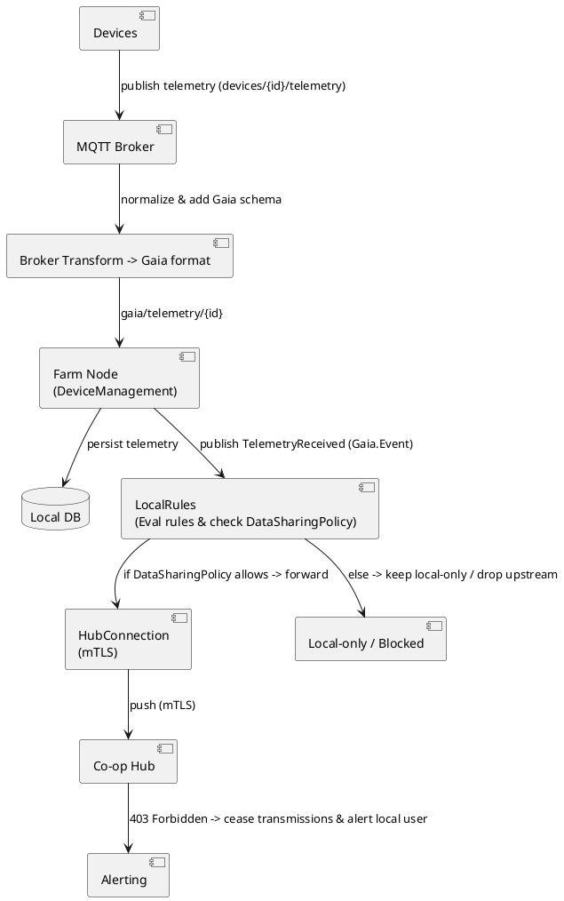

# ADR-002: Device Data Flow — Broker Normalization & LocalRules as Data Sharing Gate

Date: 2026-01-08
Status: Proposed
Authors: Farm Node Architecture (documented by the engineering assistant)

## Context

Devices on the farm publish telemetry to an MQTT broker. The broker may perform protocol-level normalization (parsing device-specific payloads into a canonical "Gaia" schema). The Farm Node ingests normalized messages, persists them in a local database, and publishes internal events to the system (e.g., `%TelemetryReceived{}` via `Phoenix.PubSub`).

Per Project rules:

- Default `DataSharingPolicy` must be `share_nothing`.
- The Node must remain offline-first (local autonomy).
- mTLS certificates provisioned during node provisioning must be stored securely (e.g., `priv/ssl/`) and used by `HubConnection` for upstream push.
- On `403 Forbidden` from the Hub, the node must immediately stop pushing data upstream and alert local users.

This ADR records the decision to make the LocalRules engine the canonical point to evaluate rules and enforce the `DataSharingPolicy` at the moment the rule triggers (i.e., LocalRules is the explicit gate for sharing).

## Decision

- Broker-side transforms will normalize raw device payloads into Gaia format before publishing to farm node topics (this simplifies downstream processing).
- `DeviceManagement` ingests normalized messages, persists telemetry in the Local DB, and broadcasts `%TelemetryReceived{}` events using `Gaia.Event` / `Phoenix.PubSub`.
- `LocalRules` will:
  - Evaluate telemetry and derive alerts/actions (e.g., "pest sighting", "soil dry").
  - Immediately check the `DataSharingPolicy` for the derived event.
  - If policy allows sharing for that event type, `LocalRules` will forward the event to `HubConnection`.
  - If policy denies sharing, `LocalRules` will keep the event local and NOT call `HubConnection`.
- `HubConnection` remains the only component trusted to communicate with the Co-op Hub. It must:
  - Load node identity (mTLS certs) from secure storage (e.g., `priv/ssl/`).
  - Maintain a heartbeat to the Hub and stop communications + alert on `403 Forbidden`.
  - Implement defense-in-depth by re-checking `DataSharingPolicy` before sending anything upstream (to handle future producers).
- All events forwarded upstream must be recorded in an audit log for compliance and traceability.

## Consequences

Positive:

- Centralized, near-source enforcement of privacy: events that should not leave the Node are blocked as soon as the rule triggers.
- Easier auditing: LocalRules is the single place to record what was considered for sharing.
- Clear separation of concerns: Broker normalizes, DeviceManagement persists & publishes, LocalRules enforces policy, HubConnection pushes upstream.

Costs / Tradeoffs:

- LocalRules must be robust and highly available to avoid blocking legitimate actions (use supervision and appropriate timeouts).
- Additional tests and monitoring are required to ensure policy logic is correct.
- We must document the types of alerts/events and policy rules clearly so LocalRules can make deterministic decisions.

## Alternatives considered

1. Enforce policy only in `HubConnection`:
   - Simpler implementation, but allows potentially sensitive events to traverse system internals and complicates auditing.
2. Enforce policy at broker (server-side):
   - Could be efficient but doesn't account for rule-derived alerts that only LocalRules can compute.
3. Hybrid: partial policy checks in broker + LocalRules:
   - Adds complexity for maintaining policy consistency across components.

We chose LocalRules-first because most sharing decisions depend on rule evaluation (derived alerts), and the project's privacy-by-design principle favors blocking at the source of the decision.

## Implementation notes

Responsibilities:

- `DeviceManagement`:
  - subscribe to normalized topics (e.g., `gaia/telemetry/{device_id}`).
  - persist telemetry to Local DB.
  - broadcast `%TelemetryReceived{}` events via `Phoenix.PubSub`.
- `LocalRules`:
  - subscribe to `TelemetryReceived` events.
  - evaluate configured rules (use `with` pattern / guard clauses).
  - consult `DataSharingPolicy` module (policy provider) when a rule produces an upstream candidate.
  - forward approved events/alerts to `HubConnection.push_*` functions.
- `HubConnection`:
  - uses mTLS certs (from `priv/ssl/` or encrypted store).
  - exposes an API `push_alert/1` and `heartbeat/0`.
  - on `403` heartbeat response: emit `HubCertificateRevoked` event, stop all pushes, and alert local user.

Example LocalRules handler (illustrative):

```elixir
defmodule LocalRules do
  def handle_telemetry(%TelemetryReceived{} = t) do
    case evaluate_rules(t) do
      nil -> :ok
      %Alert{} = alert ->
        if Policy.share_alert?(alert) do
          HubConnection.push_alert(alert)
          :shared
        else
          :kept_local
        end
    end
  end
end
```

Event and topic suggestions:

- Device -> Broker: `devices/{device_id}/telemetry` (raw)
- Broker -> Gaia topic: `gaia/telemetry/{device_id}` (normalized)
- Internal event: `%TelemetryReceived{device_id, reading, timestamp}`
- Derived alerts: `%LocalAlertTriggered{alert_type, details, timestamp}`

Testing:

- Unit tests for policy toggles (policy allows vs denies).
- Integration test: simulated broker messages -> DeviceManagement -> LocalRules -> (assert HubConnection called or not).
- Audit tests: ensure forwarded events are logged.

## Diagrams

Mermaid (primary)

```mermaid
flowchart LR
  subgraph Field
    D[Devices]
  end
  B[MQTT Broker]
  T[Broker transform\n(-> Gaia format)]
  FN[Farm Node\n(`DeviceManagement`)]
  DB[(Local DB)]
  E[TelemetryReceived\n(`Gaia.Event`)]
  LR[LocalRules\n(Evaluate rules AND check DataSharingPolicy)\n(default: `share_nothing`)]
  HC[HubConnection\n(mTLS certs in `priv/ssl/`)]
  HUB[(Co-op Hub)]
  ALERT[On 403 -> cease + alert local user]

  D -->|MQTT publish\n(e.g. `devices/{device_id}/telemetry`)| B
  B -->|transform (plugin / adapter)\nnormalize -> Gaia schema| T
  T -->|publish gaia/telemetry/{device_id}| FN
  FN -->|persist| DB
  FN -->|broadcast via\n`Gaia.Event` + `Phoenix.PubSub`| E
  E --> LR
  LR -->|policy allows -> forward/trigger -> HubConnection| HC
  LR -- policy denies -->|local-only / blocked| X[Drop / local-only]
  HC -->|mTLS push| HUB
  HUB -- 403 --> ALERT
```

ASCII (compact)

```
Devices
  |
  v
MQTT Broker (TLS auth)
  |
  v
Broker Transform (normalize -> Gaia format)
  |
  v
Farm Node (`DeviceManagement`)
  |- store telemetry in Local DB
  |- broadcast `%TelemetryReceived{}` via `Phoenix.PubSub`
  |
  v
LocalRules (evaluate rule(s) AND check `DataSharingPolicy` [default: `share_nothing`])
  |- If allowed -> forward to `HubConnection` (mTLS) -> Co-op Hub
  |- If denied  -> keep local-only / drop upstream push
  |
  v
(Co-op Hub may return 403 -> `HubConnection` must cease transmissions and alert local user)
```

PlantUML (component view)



## Related

- ADR-001: Core Project Mission (Farmer Autonomy)
- DeviceManagement, LocalRules, HubConnection modules
- `AGENTS.md` and `PROVISIONING.md` for provisioning and certificate handling

## Next steps

- Add unit and integration tests for LocalRules policy gate.
- Add audit logging for all forwarded events.
- Consider adding a small defensive policy check in `HubConnection` for future producers.
- Add this ADR to any project ADR index (e.g., `farm_node/docs/adr_index.md`) and link it from `LOCAL_RULES_ENGINE.md`.

---
