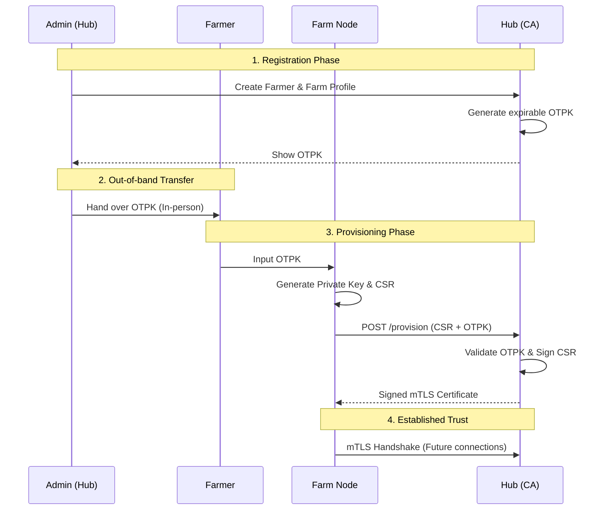

# 4. Initial Provisioning Key Exchange

Date: 2026-02-06
Status: **Proposed**

## Context
As established in [ADR 0002](./0002-hyrid-auth.md), Farm Nodes authenticate to the Hub using mTLS. However, a "chicken-and-egg" problem exists for the initial connection: a Node cannot connect via mTLS until it has a certificate signed by the Hub's Root CA, but it needs to connect to the Hub to get its certificate.

We need a secure, out-of-band mechanism to bootstrap the trust relationship between a new Farm Node and the Hub.

## Decision
We will implement a **One-Time Provisioning Key (OTPK)** exchange.

### The Flow
1.  **Registration:** An ADMIN registers a new Farmer and their Farm on the Hub dashboard.
2.  **Key Generation:** The Hub generates a high-entropy, one-time use, expirable **Provisioning Key**.
3.  **Key Delivery:** The ADMIN provides this key to the Farmer. Given the cooperative nature of Project Gaia, this is expected to happen **in-person** at the cooperative office, or via a secure secondary channel.
4.  **Bootstrapping:** The Farmer enters the Provisioning Key into the Farm Node's local interface.
5.  **Identity Creation:** The Farm Node generates its own RSA-4096 private key locally. It *never* shares this key.
6.  **Signing Request:** The Farm Node creates a Certificate Signing Request (CSR) containing its public key and identifying information.
7.  **Provisioning:** The Farm Node sends the CSR and the Provisioning Key to the Hub's provisioning endpoint over standard HTTPS.
8.  **Verification & Issuance:** The Hub validates the Provisioning Key, marks it as used, and signs the CSR using its Root CA.
9.  **Deployment:** The Hub returns the signed certificate to the Farm Node. The Node stores this certificate and thereafter uses mTLS for all communication.

### Sequence Diagram

## Consequences

### Positive
- **Security:** Private keys are generated on-device and never leave the Farm Node.
- **Trust:** The in-person exchange leverages existing social trust within the cooperative.
- **Simplicity:** Avoids complex automated enrollment protocols like SCEP or EST for the initial bootstrap.

### Negative
- **Manual Step:** Requires a physical interaction or secure out-of-band communication.
- **Expiry Management:** Provisioning keys must have a short TTL to minimize the window for interception.

## Implementation Notes
The `pkg/mtls` library must be updated to support signing externally generated CSRs. Currently, it combines key generation and CSR creation, which is suitable for the Node-side but insufficient for the Hub-side signing logic.
