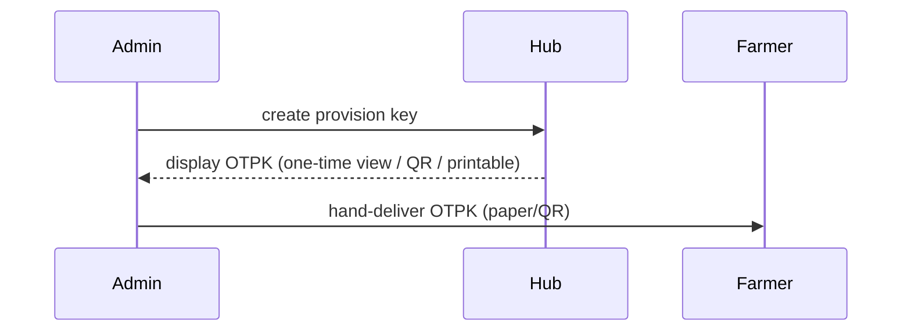

# ADR 0005 — Initial Provisioning Key Exchange

Status: accepted

Date: 2026-02-06

## Context

Project Gaia requires strong, mutual TLS (mTLS) authentication between Farm nodes (edge devices) and the Hub (central server). For security and privacy, private keys MUST be generated and stored on the Farm device and MUST never leave the device. The Hub must be able to provision a certificate for the Farm so the Farm can authenticate using mTLS.

We need a secure, auditable way for an Administrator (ADMIN) to register a new Farmer, issue a one-time, expirable provisioning key (OTPK), deliver that OTPK to the farmer, and have the Farm node use that OTPK to authenticate a Certificate Signing Request (CSR) to the Hub. Once the CSR is validated and signed by the Hub CA, the Farm receives a certificate it can use for mTLS.

Goals:
- Bootstrapped, auditable, one-time provisioning flow
- Private keys are generated on-device and never leave the device
- Provisioning keys are one-time use and expire
- Minimal attack surface for delivery of OTPK

Non-Goals:
- Long-term device lifecycle management (rotations, revocations) — this ADR only addresses initial bootstrap

## Decision

We adopt a one-time provisioning key (OTPK) workflow. The ADMIN performs a registration step in the Hub UI or API to create a Farm record and issue an OTPK. The OTPK is a high-entropy random token (e.g. 32+ bytes base58/base32), displayed once in the Hub UI and optionally printable as a QR code / paper card. The OTPK is stored in the Hub only as a secure hash (bcrypt or Argon2id) and associated metadata: farm_id, created_by, created_at, expires_at, used_at, revoked, usage_audit_id.

Delivery options (choose one or more):
- Hand-delivered printed OTPK (recommended): the farmer receives a printed card or sticker when they visit the cooperative office. This avoids networked delivery and phishing vectors.
- Ephemeral QR code on-screen: ADMIN displays OTPK as a QR/one-time view that the farmer scans with their mobile device (short expiry, e.g. 15 minutes). The scan yields the OTPK string to copy into the Farm setup UI/CLI.
- Email/SMS: allowed only with explicit risk acceptance and additional verification; avoid for highest security farms.

We define a GraphQL-first API on the Hub to accept provisioning requests: a mutation that takes the OTPK and a CSR (PEM) and returns a signed certificate (PEM). The Hub verifies OTPK against the stored hash, checks expiry and used flag, then validates and signs the CSR with the Hub CA using the existing CA signing code. After successful signing, the Hub marks the OTPK as used (stores used_at and user/audit info) and returns the certificate.

Security Controls:
- OTPK stored as a KDF/hashing output (bcrypt/Argon2id) — never store raw OTPK
- OTPK expiry is short-lived (configurable; default 24 hours)
- OTPK single-use; Hub atomically marks it used during CSR submission to prevent replay
- All provisioning API endpoints are rate-limited and audited
- CA private key stored in a secure location (KMS/HSM recommended)

## Hub Database Schema (ProvisioningKeys table)

Table: provisioning_keys
- id: uuid (primary key)
- farm_id: uuid (foreign key -> farms)
- key_hash: text (bcrypt/argon2id hash of OTPK)
- created_by: uuid (admin user id)
- created_at: timestamptz
- expires_at: timestamptz
- used_at: timestamptz NULLABLE
- used_by_request_id: uuid NULLABLE (links to csr_requests/audit)
- revoked: boolean DEFAULT false
- note: text NULLABLE

Indexes: farm_id, expires_at, revoked

API-level model: store the returned signed certificate serial number and fingerprint mapping to provisioning key usage for audit.

## GraphQL Mutation (proposal)

Mutation: `provisionFarm(csr: String!, provisionKey: String!): ProvisionResult!`

Inputs:
- csr: PEM-encoded Certificate Signing Request (string)
- provisionKey: OTPK string provided to the farmer

Outputs (`ProvisionResult`):
- certificate: PEM-encoded signed certificate
- caCertificate: PEM-encoded Hub Root CA (optional; conditionally returned)
- serialNumber: string
- fingerprint: string (SHA256)
- expiresAt: timestamptz

Server-side steps:
1. Authenticate the caller (the requestor may be anonymous from the farm device; the OTPK proves right to provision the associated farm)
2. Lookup provisioning key hash by OTPK value (compare via bcrypt/Argon2 verify)
3. Verify provisioning key is not expired/not used/not revoked
4. Parse and validate CSR (PEM); ensure signature valid
5. Optionally validate CSR fields: CN=farm_id or include SAN that references farm metadata
6. Sign CSR using Hub CA (Call into `pkg/mtls.CertificateAuthority.SignCSR`)
7. Persist audit record (provisioning_keys.used_at, used_by_request_id), store certificate serial mapping to farm
8. Return signed certificate (and CA certificate if allowed)

Atomicity: Step 2–7 is performed transactionally. When marking OTPK used, make sure signing is idempotent in the event of transient errors; design a small request-audit table to avoid race conditions.

## Farm (Node) Behavior

1. Farmer receives OTPK (paper/QR) from ADMIN.
2. Farmer runs setup on Farm node (CLI or UI) and inputs OTPK.
3. Farm node generates RSA-4096 private key locally.
4. Farm node creates a CSR containing subject information and (recommended) SubjectAlternativeName with the farm_id and other identifiers.
5. Farm node sends GraphQL mutation `provisionFarm(csr, provisionKey)` to Hub endpoint over an untrusted channel (HTTPS). Because the OTPK authenticates the request, this initial call does not require mTLS. Subsequent communication MUST use mTLS.
6. Hub verifies OTPK and CSR, signs CSR, and returns signed client certificate.
7. Farm stores the certificate and private key locally and configures mTLS for future connections to Hub.

Notes:
- The Farm MUST keep the private key private; no private key bytes are sent to Hub.
- Use robust key protection on the device (filesystem perms, optional hardware-backed keys)

## Verification of existing implementation (`pkg/mtls/certs.go`)

Findings:
- `CertificateAuthority.SignCSR(csrPem []byte, validityDays int)` accepts a PEM-encoded CSR, parses it, checks the signature, prepares a certificate template and signs it with the CA private key using `x509.CreateCertificate` with `csr.PublicKey`.
- The produced certificate has `ExtKeyUsage` set to `x509.ExtKeyUsageClientAuth`, `KeyUsage` set to `x509.KeyUsageDigitalSignature`, and `IsCA=false`.
- `CreateCSRCertificate` currently generates a private key locally and returns CSR, private key, and public key. This helper is useful for tests and local flows, but for production Farm nodes the node itself must generate the key pair and submit the CSR to the Hub (i.e., do not use CreateCSRCertificate to generate a key on the Hub).

Conclusion: `SignCSR` implements the core server-side signing correctly for the provisioning flow: it expects a CSR from the caller and signs CSR.PublicKey using the CA private key. This matches the security goal that private keys are generated and kept on-device; the Hub never needs to generate or receive the private key.

Recommended follow-ups for `pkg/mtls`:
- Add a unit test that calls `SignCSR` with a CSR generated by a simulated Farm (CSR created with RSA-4096 generated locally) and asserts:
  - returned certificate verifies against CA
  - certificate contains expected Extended Key Usage (ClientAuth)
  - certificate subject or SAN contains expected farm identifier (if Hub policy enforces farm binding)
- Add optional CSR policy enforcement in `SignCSR` or a wrapper: reject CSRs that don't include required SANs/CN format or that request disallowed extensions.
- Consider returning parsed certificate metadata (serial, fingerprint) from `SignCSR` in addition to PEM for easier db recording.

## Example sequence (Mermaid)

Admin issues OTPK (in-person delivery recommended):



Farm bootstrapping flow:

```mermaid
sequenceDiagram
    participant FarmerDevice as "Farmer Device"
    participant Hub

    FarmerDevice->>FarmerDevice: generate RSA-4096 keypair (private stays local)
    FarmerDevice->>Hub: POST CSR + OTPK (HTTPS, no mTLS yet)
    Hub->>Hub: validate OTPK (hash match, expiry, unused)
    Hub->>Hub: validate CSR (parse, signature, policy)
    Hub->>Hub: sign CSR with CA (SignCSR)
    Hub-->>FarmerDevice: return signed certificate PEM
    FarmerDevice->>FarmerDevice: store certificate + private key; enable mTLS
```

## Edge cases and considerations
- Race conditions: two simultaneous attempts using the same OTPK must result in at most one successful provisioning. Implement database-level uniqueness/locking or a "used_at" CAS update to ensure single-use.
- OTPK leakage: keep display time short and encourage in-person delivery. If using QR/email/SMS, add multi-factor verification (SMS to verified phone or code confirmation).
- Expiry: default expiry 24 hours; make configurable appliance-level short lifetimes for high security.
- Revocation: after provisioning, support normal certificate revocation/rotation procedures. Mark provisioning key as used and do not accept again.
- Audit: store audit entries with admin id, farm id, CSR fingerprint, signed certificate serial, and timestamp.

## Consequences

- Positive: Simple, auditable bootstrap giving privacy guarantees (private keys stay on-device) and minimal trust placed in network delivery of OTPK.
- Negative: Operator burden — the ADMIN must securely deliver OTPKs (in-person recommended) and supervise the provisioning.

## Implementation Notes (next steps)

1. Add `provisioning_keys` schema and migration in Hub (recommended `ent` or SQL migration). Include the fields listed above.
2. Implement GraphQL mutation `provisionFarm` in `apps/hub` following the steps in this ADR. Use `pkg/mtls.CertificateAuthority.SignCSR` to sign CSRs.
3. Add tests in `pkg/mtls` to validate `SignCSR` behavior with externally generated CSRs.
4. Implement Farm setup CLI in `apps/farm` that: (a) generates RSA-4096 keypair; (b) creates CSR; (c) asks for provisionKey from farmer; (d) calls Hub API; (e) stores returned cert.
5. Ensure CA private key storage is hardened (KMS/HSM) and audit logs track usage.

## Appendix — Example GraphQL mutation (sketch)

mutation provisionFarm($csr: String!, $provisionKey: String!) {
  provisionFarm(csr: $csr, provisionKey: $provisionKey) {
    certificate
    caCertificate
    serialNumber
    fingerprint
    expiresAt
  }
}

---

Authors: Project Gaia Team
